# Architecture Overview

## Design Principles

1. **Simplicity First** - Easy to understand, explain, and enhance
2. **Production Patterns** - Real-world best practices without over-engineering
3. **Cloud Agnostic** - Works locally, on GCP, and AWS
4. **Cost Effective** - Storage bucket approach for POC (easily upgradeable)

## System Architecture Diagram

## Component Breakdown

### 1. API Layer (`app/main.py`)
**Responsibility:** HTTP interface and request handling

- FastAPI application with automatic OpenAPI documentation
- Lifecycle management (startup/shutdown)
- Environment-based configuration
- Error handling and HTTP status codes
- Health check endpoint for load balancers

**Key Decisions:**
- Used FastAPI for modern async support and auto-docs
- Lifespan context manager for clean startup/shutdown
- Global state for simplicity (acceptable for single-instance POC)

### 2. Business Logic (`app/tree_manager.py`)
**Responsibility:** Tree operations and data integrity

- In-memory tree structure for fast operations
- Node map for O(1) lookups by ID
- State serialization/deserialization
- ID generation and parent-child relationships

**Key Decisions:**
- In-memory for speed (acceptable for POC scale)
- Separate node map for efficient parent lookups
- Immutable IDs (auto-increment)

### 3. Data Models (`app/models.py`)
**Responsibility:** Data validation and serialization

- Pydantic models for automatic validation
- Type safety and documentation
- Request/response schemas

**Key Decisions:**
- Recursive TreeNode model for hierarchical structure
- Separate request/response models for API clarity

### 4. Storage Abstraction (`app/storage.py`)
**Responsibility:** Persistence across different backends

- Abstract base class defining storage interface
- Three implementations: Local, GCS, S3
- Atomic writes for data integrity
- Health checks for each backend

**Key Decisions:**
- JSON format for human readability and simplicity
- Atomic writes (temp file + rename) prevent corruption
- Versioning enabled in cloud storage for rollback capability
- Factory pattern for easy backend switching

### 5. Observability (`app/logging_config.py`)
**Responsibility:** Structured logging for debugging and monitoring

- JSON-formatted logs for easy parsing
- Consistent log structure across all components
- Appropriate log levels (INFO for operations, ERROR for failures)

**Key Decisions:**
- JSON logs work with CloudWatch, Cloud Logging, etc.
- Reduced noise from third-party libraries
- Timestamp included for correlation

## Data Flow

### Creating a Node

```mermaid
sequenceDiagram
    participant C as 🌐 Client
    participant API as ⚡ FastAPI
    participant TM as 🧠 TreeManager
    participant S as 💾 Storage
    participant B as 📁 Backend<br/>(Local/GCS/S3)

    C->>API: POST /api/tree<br/>{label, parent_id}
    activate API
    API->>API: ✓ Validate with<br/>Pydantic Model
    API->>TM: create_node(label, parent_id)
    activate TM
    TM->>TM: 🌳 Create node<br/>Update in-memory tree
    TM->>TM: 🗺️ Update node map<br/>O(1) lookup
    TM-->>API: Return new node
    deactivate TM
    API->>S: save(tree_state)
    activate S
    S->>B: Write JSON<br/>(atomic operation)
    activate B
    B-->>S: ✓ Success
    deactivate B
    S-->>API: ✓ Success
    deactivate S
    API-->>C: 201 Created<br/>{id, label, parent_id}
    deactivate API
```

### Retrieving Trees

```mermaid
sequenceDiagram
    participant C as 🌐 Client
    participant API as ⚡ FastAPI
    participant TM as 🧠 TreeManager

    C->>API: GET /api/tree
    activate API
    API->>TM: get_all_trees()
    activate TM
    TM->>TM: 🌳 Return in-memory trees<br/>O(1) operation
    TM-->>API: List[TreeNode]
    deactivate TM
    API->>API: 📦 Serialize to JSON<br/>Pydantic models
    API-->>C: 200 OK<br/>[{tree structure}]
    deactivate API
```

## Error Handling Strategy

### Graceful Degradation
- **Storage unavailable**: Health check fails (503), but API stays up
- **Parent not found**: Clear 404 error with message
- **Invalid input**: 422 validation error from Pydantic
- **Corrupted data**: Logged with details, 500 error to client

### Critical Failures
- **Storage initialization fails**: Application won't start (fail fast)
- **Data load fails**: Application won't start (data integrity)

## Scalability Considerations

### Current Limitations (POC)
- Single instance (global state)
- In-memory storage (limited by RAM)
- No caching layer
- No authentication

### Migration Path
1. **Phase 1 (Current)**: Single instance + cloud storage
2. **Phase 2**: Add PostgreSQL, keep in-memory cache
3. **Phase 3**: Add Redis for distributed caching
4. **Phase 4**: Horizontal scaling with load balancer

## Security Considerations

### Implemented
- Input validation (Pydantic)
- No SQL injection risk (no SQL)
- Atomic writes prevent race conditions
- IAM-based cloud storage access

### Future Additions
- API authentication (API keys, OAuth2)
- Rate limiting
- Request size limits
- CORS configuration

## Testing Strategy

### Unit Tests (`tests/test_tree_manager.py`, `tests/test_storage.py`)
- Test individual components in isolation
- Mock external dependencies
- Cover edge cases and error conditions

### Integration Tests (`tests/test_api.py`)
- Test full request/response cycle
- Verify API contracts
- Test error responses

### Coverage
- All core functionality tested
- Edge cases: parent not found, corrupted data, empty state
- Error paths validated

## Deployment Architecture

```mermaid
graph LR
    subgraph Local["💻 Local Development"]
        DevMachine["🖥️ Developer Machine<br/>macOS/Linux/Windows"]
        Venv["🐍 Python venv<br/>Isolated Dependencies"]
        LocalFile["📁 Local Storage<br/>data/trees.json"]
        Uvicorn["⚡ Uvicorn Server<br/>localhost:8000"]
    end

    subgraph GCP["☁️ GCP Production"]
        CloudRun["🐳 Cloud Run<br/>Serverless Container<br/>Auto-scaling"]
        GCSSA["🔐 Service Account<br/>storage.objectAdmin"]
        GCSBkt["🗄️ GCS Bucket<br/>Versioned<br/>Lifecycle Rules"]
    end

    subgraph AWS["☁️ AWS Production"]
        Fargate["🐳 ECS Fargate<br/>Serverless Container<br/>Auto-scaling"]
        IAMRole["🔐 IAM Role<br/>s3:GetObject<br/>s3:PutObject"]
        S3Bkt["🗄️ S3 Bucket<br/>Versioned<br/>Lifecycle Rules"]
    end

    subgraph CICD["🔄 CI/CD Pipeline"]
        GitHub["⚙️ GitHub Actions<br/>GitLab CI"]
        TerraformSA["🏗️ Terraform<br/>Infrastructure as Code"]
        Docker["🐳 Docker Registry<br/>GCR / ECR"]
    end

    DevMachine --> Venv
    Venv --> Uvicorn
    Uvicorn --> LocalFile

    GitHub --> TerraformSA
    TerraformSA --> GCSBkt
    TerraformSA --> S3Bkt
    GitHub --> Docker
    Docker --> CloudRun
    Docker --> Fargate

    CloudRun --> GCSSA
    GCSSA --> GCSBkt

    Fargate --> IAMRole
    IAMRole --> S3Bkt

    style CloudRun fill:#4285F4,stroke:#1967D2,color:#fff,stroke-width:3px
    style Fargate fill:#FF9900,stroke:#CC7A00,color:#fff,stroke-width:3px
    style GitHub fill:#2088FF,stroke:#0366D6,color:#fff,stroke-width:3px
    style Docker fill:#2496ED,stroke:#1488DB,color:#fff,stroke-width:3px
    style GCSBkt fill:#4285F4,stroke:#1967D2,color:#fff
    style S3Bkt fill:#FF9900,stroke:#CC7A00,color:#fff
    style Uvicorn fill:#009688,stroke:#00796B,color:#fff
```

## Cost Optimization

1. **Storage**: JSON in bucket vs database saves ~$20-50/month
2. **Compute**: Serverless (Cloud Run/Lambda) for variable traffic
3. **Versioning**: Lifecycle policies delete old versions
4. **Monitoring**: Use cloud provider's free tier logging

## Future Enhancements (Discussion Points)

1. **Database Migration**: When to move from JSON to PostgreSQL?
2. **Caching**: Redis for frequently accessed trees
3. **Real-time Updates**: WebSocket support for live collaboration
4. **Bulk Operations**: Import/export entire forests
5. **Tree Validation**: Prevent cycles, enforce depth limits
6. **Soft Deletes**: Archive instead of delete
7. **Audit Log**: Track all changes with timestamps
8. **Multi-tenancy**: Separate trees by organization/user

---

**Author**: Erika Sissons
**Date**: January 2026
